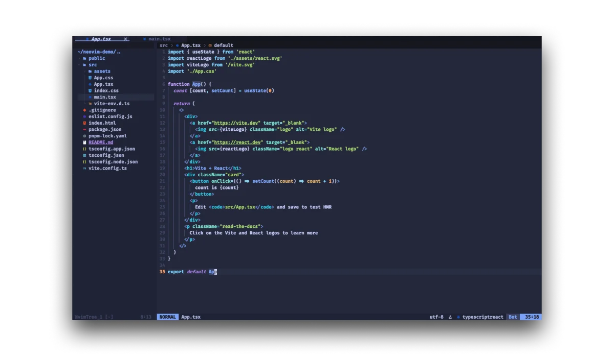

# Neovim Configuration

A modern, IDE-like Neovim configuration with comprehensive LSP support, optimized for **TypeScript, Python, Go, and Rust** development featuring the Tokyo Night theme.



## Features

### 🚀 Core Infrastructure

- [lazy.nvim](https://github.com/folke/lazy.nvim) as a fast, modern plugin manager
- 🌙 [Tokyo Night](https://github.com/folke/tokyonight.nvim) color scheme for a clean, modern look
- ⚡ Optimized startup time with lazy loading
- 🏗️ Well-structured, maintainable configuration

### 🔍 LSP & Language Support

Full LSP integration via [nvim-lspconfig](https://github.com/neovim/nvim-lspconfig) with:

- **TypeScript/JavaScript** - Full-stack development with ESLint, Prettier
- **Python** - Data science ready with Black, isort, ruff
- **Go** - Enterprise development with gopls, golangci-lint, gofumpt
- **Rust** - Modern systems programming with rust-analyzer, clippy
- **TailwindCSS** - Modern CSS framework support
- **HTML/CSS** - Web development essentials

### 🔧 Development Tools

- 📊 Syntax highlighting with [Treesitter](https://github.com/nvim-treesitter/nvim-treesitter)
- 📝 Intelligent auto-completion via [nvim-cmp](https://github.com/hrsh7th/nvim-cmp)
- 💅 Code formatting with [conform.nvim](https://github.com/stevearc/conform.nvim)
- 🔬 Fast linting with [nvim-lint](https://github.com/mfussenegger/nvim-lint) + `eslint_d` for JavaScript/TypeScript
- ⚡ Optimized ESLint auto-fixing on save (faster than traditional LSP approach)
- 🐛 Multi-language debugging with [nvim-dap](https://github.com/mfussenegger/nvim-dap)

### 🌟 Language-Specific Features

- **Go**: [go.nvim](https://github.com/ray-x/go.nvim) for advanced Go development
- **Rust**: [crates.nvim](https://github.com/saecki/crates.nvim) for Cargo dependency management
- **Python**: Virtual environment management with [swenv.nvim](https://github.com/AckslD/swenv.nvim)
- **JavaScript/TypeScript**: Advanced project detection and configuration

### 🎨 UI/UX Enhancement

- 🔎 Fuzzy finding with [Telescope](https://github.com/nvim-telescope/telescope.nvim)
- 📁 File navigation with [nvim-tree](https://github.com/nvim-tree/nvim-tree.lua)
- 📑 Enhanced UI with [bufferline](https://github.com/akinsho/bufferline.nvim), [lualine](https://github.com/nvim-lualine/lualine.nvim)
- 🍞 Breadcrumb navigation with [barbecue](https://github.com/utilyre/barbecue.nvim)
- ⚡ Lightning-fast navigation with [harpoon](https://github.com/ThePrimeagen/harpoon)
- 🎭 Integrated terminal with [toggleterm](https://github.com/akinsho/toggleterm.nvim)
- ⚡ Quick jump navigation with [flash.nvim](https://github.com/folke/flash.nvim)

### 🔄 Git Integration

- Real-time git changes with [gitsigns](https://github.com/lewis6991/gitsigns.nvim)
- Full git workflow with [fugitive](https://github.com/tpope/vim-fugitive)
- Conflict resolution with [git-conflict.nvim](https://github.com/akinsho/git-conflict.nvim)
- Git diff viewer with [diffview.nvim](https://github.com/sindrets/diffview.nvim)

### 🔗 VS Code Integration

Seamless compatibility with existing VS Code projects:

- **Automatic Settings Sync** - Reads and applies `.vscode/settings.json` configurations
- **TailwindCSS Compatibility** - Matches VS Code's `classAttributes` and `experimental.classRegex` patterns exactly
- **ESLint Auto-fix** - Fast auto-fix on save using `eslint_d` (implements VS Code's `"source.fixAll.eslint": "explicit"`)
- **Modern ESLint Support** - Works with flat config (`eslint.config.js`) and traditional `.eslintrc` configurations
- **Prettier Configuration** - Respects project-specific prettier configs and formatting rules
- **Unified Spell Check** - Automatically imports custom words from VS Code's `cSpell.words` settings
- **Project Detection** - Smart detection of frontend, backend, CDK, and other project types
- **Performance Optimized** - Uses `eslint_d` for fast linting and auto-fixing without LSP overhead

### 🛠️ Additional Utilities

- 🔍 Advanced search highlighting with [hlslens](https://github.com/kevinhwang91/nvim-hlslens)
- 📋 Clipboard history with [neoclip](https://github.com/AckslD/nvim-neoclip.lua)
- 🏷️ TODO comments tracking with [todo-comments](https://github.com/folke/todo-comments.nvim)
- 🎨 Color highlighting with [colorizer](https://github.com/norcalli/nvim-colorizer.lua)
- 🔧 Problem diagnostics with [trouble.nvim](https://github.com/folke/trouble.nvim)

## System Requirements

- **Neovim** >= 0.9.0 (0.10+ recommended)
- **Git** for version control and plugin management
- [**ripgrep**](https://github.com/BurntSushi/ripgrep) for Telescope file search
- [**fd**](https://github.com/sharkdp/fd) for Telescope file finder
- A [**Nerd Font**](https://www.nerdfonts.com/) for icons (JetBrains Mono recommended)

### Language-Specific Requirements

#### JavaScript/TypeScript

- **Node.js** and **npm** (for LSP servers and tools)

#### Python

- **Python 3.8+**
- **pip** for package management
- Recommended: **pyenv** for Python version management

#### Go

- **Go 1.19+**
- **golangci-lint** for comprehensive linting

#### Rust

- **Rust** (latest stable) installed via [rustup](https://rustup.rs/)
- **Required components** (install via rustup, NOT Mason):
  ```bash
  rustup component add rust-analyzer clippy rustfmt
  # Note: rustfmt and clippy are part of the Rust toolchain and should be installed via rustup, not Mason
  ```
- **rust-analyzer**, **clippy**, **rustfmt** (installed via `rustup component add`)

## Installation

### 1. Backup your existing configuration (if any)

```bash
mv ~/.config/nvim ~/.config/nvim.bak
```

### 2. Clone this repository

```bash
git clone https://github.com/weirdry/nvim-config.git ~/.config/nvim
```

### 3. Install system dependencies

```bash
# macOS (via Homebrew)
brew install ripgrep fd

# Ubuntu/Debian
sudo apt install ripgrep fd-find

# Arch Linux
sudo pacman -S ripgrep fd
```

### 4. Install language tools

```bash
# Rust (if not installed)
curl --proto '=https' --tlsv1.2 -sSf https://sh.rustup.rs | sh
rustup component add rust-analyzer clippy rustfmt

# Go tools (if using Go)
go install github.com/golangci/golangci-lint/cmd/golangci-lint@latest
```

### 5. Launch Neovim

```bash
nvim
```

The plugins will be automatically installed on the first launch via Mason and lazy.nvim.

## Key Mappings

### General Navigation

- `<Space>` - Leader key
- `<leader>ff` - Find files
- `<leader>fg` - Live grep (search text)
- `<leader>fb` - Browse buffers
- `<leader>fh` - Search help tags
- `<leader>fw` - Search current word
- `<Esc><Esc>` - Clear search highlights

### File Management

- `<leader>ft` - Toggle file explorer
- `<leader>fT` - Search TODOs
- `<leader>fn` - Clipboard history

### LSP (Language Server)

- `gd` - Go to definition
- `gr` - Find references
- `gi` - Go to implementation
- `K` - Show hover information
- `<leader>rn` - Rename symbol
- `<leader>ca` - Code actions

### Buffer Management

- `<Tab>` - Next buffer
- `<S-Tab>` - Previous buffer
- `<leader>bc` - Close buffer (pick)
- `<leader>bo` - Close all other buffers
- `<leader>bp` - Pick buffer
- `<leader>bs` - Sort buffers

### Harpoon (Quick Navigation)

- `<leader>ha` - Add file to Harpoon
- `<leader>hm` - Toggle Harpoon menu
- `<leader>h1-4` - Jump to Harpoon file 1-4
- `<leader>hp/hn` - Previous/Next Harpoon file

### Rust Development

- `<leader>rh` - Toggle inlay hints
- `<leader>cr` - Cargo run
- `<leader>ct` - Cargo test
- `<leader>cc` - Cargo check
- `<leader>cb` - Cargo build
- `<leader>cC` - Cargo clippy
- `<leader>cw` - Cargo watch
- `<leader>cf` - Cargo format
- `<leader>rc` - Find Cargo.toml
- `<leader>rs` - Search in Rust files

### Go Development

- `<leader>gtf` - Go to type definition
- `<leader>gim` - Go to implementation
- Auto-formatting on save with goimports

### Diagnostics & Debugging

- `[d` - Previous diagnostic
- `]d` - Next diagnostic
- `<leader>e` - Show diagnostic details
- `<leader>q` - Show diagnostic list
- `<leader>xx` - Toggle Trouble diagnostics

### Terminal

- `<C-\>` - Toggle floating terminal
- `<Esc><Esc>` - Exit terminal mode (in terminal)

### Quick Actions

- `s` - Flash jump (quick navigation)
- `<leader>fs` - Flash treesitter search
- `<leader>sv` - Select Python virtual environment

## Project Structure

```
~/.config/nvim/
├── init.lua              # Main configuration file
├── README.md            # This file
└── screenshots/         # Configuration screenshots
    └── screenshot.webp
```

## Customization

This configuration is designed to be easily customizable:

### Adding New Languages

1. Add LSP server to `mason-lspconfig` ensure_installed list
2. Configure LSP in the LSP settings section
3. Add formatters/linters to respective sections
4. Add language-specific autocmds if needed

### Modifying Key Mappings

All key mappings are centralized in the "키 매핑 (Keymaps)" section for easy modification.

### Plugin Configuration

Each plugin configuration is clearly separated and documented within the lazy.nvim setup block.

## Troubleshooting

### Common Issues

1. **LSP not working**: Ensure language servers are installed via `:Mason`
2. **Icons not showing**: Install a Nerd Font and set it in your terminal
3. **Slow startup**: Check `:Lazy profile` for plugin loading times
4. **ESLint auto-fix not working**: Ensure `eslint_d` is installed via Mason and project has valid ESLint config
5. **Formatting not working**: Verify formatters are installed and configured

### Useful Commands

- `:Mason` - Manage LSP servers and tools
- `:Lazy` - Manage plugins
- `:checkhealth` - Check Neovim health
- `:LspInfo` - Check LSP status
- `:Telescope diagnostics` - View all diagnostics

## Performance

This configuration is optimized for performance with:

- **Lazy loading** for most plugins
- **Async formatting and linting** with background job processing
- **Optimized ESLint workflow** - `eslint_d` daemon for instant linting and auto-fixing
- **Smart project detection** - Conditional tool loading based on project type
- **Fast buffer reloading** - Optimized file change detection after auto-fixes
- **Large file optimizations** - Automatic syntax/TreeSitter disabling for files >1MB
- **Pre-initialized formatters** - Background loading of formatting tools on startup

## Credits

Special thanks to the Neovim community and all the plugin authors that make this configuration possible:

- [Folke Lemaitre](https://github.com/folke) for lazy.nvim, tokyonight, and many other excellent plugins
- [ThePrimeagen](https://github.com/ThePrimeagen) for Harpoon
- [nvim-treesitter](https://github.com/nvim-treesitter) team
- All LSP server maintainers and the broader open-source community

## License

MIT
